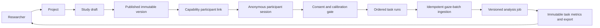

# WebGaze Research

An independent, clean-room full-stack UX-research platform for designing versioned studies, running consent-aware participant flows, ingesting gaze-like telemetry, and producing reproducible task-level results.

**Live:** [web app](https://webgaze-research.vercel.app) · [API docs](https://remoteeyetrackingmarketresearch-production.up.railway.app/api/docs) · [health check](https://remoteeyetrackingmarketresearch-production.up.railway.app/healthz)

> This is a public portfolio project. The standalone participant experience uses clearly disclosed synthetic samples; it does not collect camera frames or claim to estimate a person's gaze. No employer code, data, assets, or internal systems were used to implement this repository.

## Why this exists

I built WebGaze Research to demonstrate engineering work beyond a UI prototype:

- a normalized research domain model and reversible PostgreSQL migrations;
- immutable study versions and capability-scoped participant links;
- explicit session state transitions, quality gates, and idempotent ingestion;
- analysis jobs with versioned, immutable outputs;
- generated OpenAPI-to-TypeScript contracts, automated tests, and production deployment across Vercel and Railway.

The project is intentionally honest about its boundary. It models the systems needed to run a remote eye-tracking study, while the public web demo uses synthetic telemetry rather than biometric collection.

## Product flow



## Engineering decisions

| Concern | Decision | Why it matters |
|---|---|---|
| Protocol edits | Drafts publish as immutable versions | A participant session always runs the exact consent and task protocol it started with. |
| Participant access | High-entropy, hash-stored capability tokens | No participant account or direct identifier is necessary. |
| Collection correctness | Server-owned lifecycle state machine | Prevents consent skips, overlapping tasks, out-of-order calibration, and collection before quality acceptance. |
| Unreliable networks | Sequence-numbered batches plus payload checksum | A client can retry safely; duplicates replay and conflicting retries fail explicitly. |
| Analysis | Idempotent, versioned job/result pair | Results are reproducible and never silently overwritten. |
| Data provenance | Synthetic demo results are labelled and aggregate-ineligible | The public demo does not make claims from fabricated telemetry. |
| Frontend contracts | OpenAPI is generated from FastAPI and TypeScript types are generated in CI | Prevents silently drifting frontend/backend interfaces. |

More detailed reasoning is in the [architecture notes](docs/architecture.md) and [ADRs](docs/adr).

## Features implemented

- Project workspace and a dedicated project-creation flow
- Study drafts with one to four ordered tasks
- Immutable publishing and participant-link creation
- Consent, calibration-quality, task-run, and participant-session state machine
- Browser-local offline queue with retry-safe gaze batch ingestion
- Versioned task-level analysis jobs and clearly marked synthetic fixtures
- Researcher results dashboard, session comparison, collection-health summaries
- CSV and JSON analysis exports with export audit events
- Owner-scoped API resources, generated REST documentation, and contract checks
- Local-only experimental eye tracking: webcam → on-device face/iris landmarks → nine-point calibration → gaze estimate

## Repository layout

```text
apps/api/                 FastAPI, SQLAlchemy models, Alembic migrations, tests
apps/web/                 React/Vite researcher and participant experiences
packages/api-contract/    Committed OpenAPI document and generated TS types
extension/                Separate browser-extension collection baseline
docs/adr/                 Architectural decision records
docs/clean-room/          Public functional spec, data dictionary, and boundaries
docs/demo-runbook.md      Five-minute recruiter/interview demo
docs/experimental-eye-tracking.md  Local-only experimental eye-tracking design and limits
```

## Run locally

Requirements: Python 3.10+, Node.js 22+, and PostgreSQL (Docker is convenient).

```bash
python3 -m venv .venv
.venv/bin/python -m pip install -e 'apps/api[dev]'
npm install
docker compose up -d postgres
npm run db:migrate
npm run db:seed
.venv/bin/uvicorn webgaze_api.main:app --app-dir apps/api --reload
```

In a second terminal:

```bash
npm run dev:web
```

Open `http://localhost:5173`. API documentation is available at `http://localhost:8000/api/docs`.

The public participant route remains synthetic by design. For the separate,
real webcam-based experimental client, open
`http://localhost:5173/experimental/eye-tracking` and read the
[experimental tracking guide](docs/experimental-eye-tracking.md) first.

## Verify changes

```bash
npm test
npm run build:web
npm run generate:contract
.venv/bin/ruff check apps/api
```

CI runs the same suite, verifies that generated API contracts are committed, and applies/reverses/reapplies the production migration path against PostgreSQL.

## Deployment

The app is deliberately split by trust boundary:

```text
Vercel React/Vite app
  └─ HTTPS REST requests
       └─ Railway FastAPI service
            └─ private Railway PostgreSQL network
```

Vercel receives only `VITE_API_URL`. Railway owns database credentials and permits browser requests only from the Vercel production origin. See the [production runbook](docs/production-runbook.md) before deploying a fresh copy.

## Responsible-use and clean-room boundary

This repository is suitable for synthetic demonstrations and exploratory engineering work. It is not a production system for real participant or biometric data. Real deployment requires researcher authentication, abuse controls, explicit consent review, data-retention enforcement, and applicable privacy/security review.

Read the [source boundary](docs/clean-room/source-boundary.md), [functional specification](docs/clean-room/functional-spec.md), [data dictionary](docs/clean-room/data-dictionary.md), and [demo runbook](docs/demo-runbook.md) for the full context.
